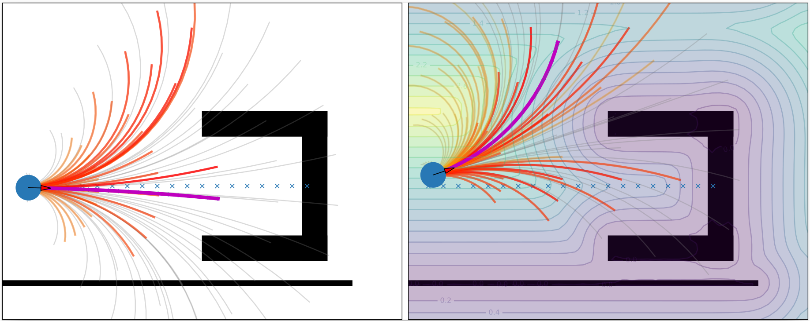

# Complex Obstacle Avoidance and Fleet Collision Avoidance: Gaussian Process Distance Field (GPDF) and Dynamic Window Approach (DWA)
For safe and flexible navigation in multi-robot systems, this work presents an enhanced and predictive sampling-based trajectory planning approach in complex environments, the Gradient Field-based Dynamic Window Approach (GF-DWA). 
Building upon the dynamic window approach, the proposed method utilizes gradient information of obstacle distances as a new cost term to anticipate potential collisions. This enhancement enables the robot to improve awareness of obstacles, including those with non-convex shapes. 

The GPDF part is based on [this work](https://github.com/cr139139/gpdf-demo). The permission to use and extend the original GPDF code has been granted by its author.

## Publication
The paper is accepted by IROS 2025.

Bibtex citation:
```
NOT YET
```



## Quick Start

### JAX
The GPDF is implemented in Google JAX. Please find the installation guide [here](https://docs.jax.dev/en/latest/quickstart.html).

### Install dependencies
```
pip install -r requirements.txt
```

## Use Case
There is no need to have any pre-training or pre-learned model. This method is off-the-shelf.
Run *main_base.py* for the simulation (different scenarios and methods) in Python. The evaluation is activated by setting the *evaluation* variable to **True**.
Change `scenario_index` and `tracker_type` in the code to select different scenarios and methods.

To watch the demo videos:
- Single-robot and multi-robot: [Link](https://youtu.be/Et4C5oGHlF0)

More videos from other projects are available on my [personal page](https://woodenonez.github.io/).
